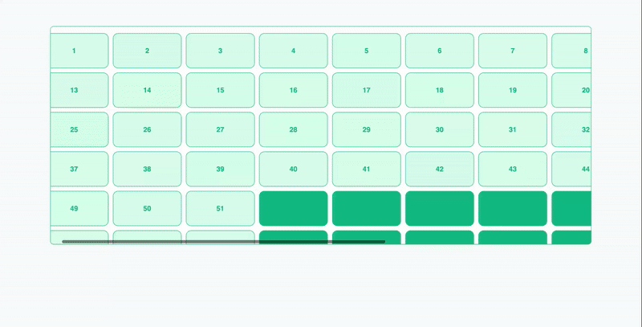

# Vue3 Drag Selector

[](https://www.npmjs.com/package/vue3-drag-selector)
[](https://www.npmjs.com/package/vue3-drag-selector)
[](https://github.com/JamshidDev/vue3-drag-selector/blob/main/LICENSE)

<p align="center">
  <a href="#english">🇬🇧 English</a> • <a href="#uzbek">🇺🇿 O'zbekcha</a>
</p>



---

<h2 id="english">🇬🇧 English</h2>

A **Vue 3** component for drag-to-select functionality with **auto-scroll** support. Perfect for selecting multiple items in a scrollable container.

[Demo](https://vue3-drag-selector.netlify.app) | [NPM](https://www.npmjs.com/package/vue3-drag-selector)

### ✨ Features

- 🖱️ Drag to select multiple items
- 📜 Auto-scroll when dragging near container edges
- ⚡ Live selection updates (optional)
- 🎨 Customizable selection box colors
- 🔧 Configurable scroll zones and speeds
- 📦 Zero dependencies

### 📦 Installation
```bash
npm install vue3-drag-selector
```
```bash
yarn add vue3-drag-selector
```
```bash
pnpm add vue3-drag-selector
```

### 🚀 Quick Start

#### Global Registration
```js
import { createApp } from 'vue'
import App from './App.vue'
import Vue3DragSelector from 'vue3-drag-selector'

const app = createApp(App)
app.use(Vue3DragSelector)
app.mount('#app')
```

#### Local Registration
```vue
<script setup>
import { DragSelector } from 'vue3-drag-selector'
</script>
```

### 📝 Basic Example
```vue
<template>
  <DragSelector
    @selection-change="onSelectionChange"
    class="container"
  >
    <div class="grid">
      <div
        v-for="item in items"
        :key="item.id"
        data-selectable
        :data-id="item.id"
        class="item"
        :class="{ selected: selectedIds.includes(item.id) }"
      >
        {{ item.name }}
      </div>
    </div>
  </DragSelector>
</template>

<script setup>
import { ref } from 'vue'
import { DragSelector } from 'vue3-drag-selector'

const items = ref([
  { id: '1', name: 'Item 1' },
  { id: '2', name: 'Item 2' },
  { id: '3', name: 'Item 3' },
])

const selectedIds = ref([])

const onSelectionChange = (selected) => {
  selectedIds.value = selected.map(item => item.id)
}
</script>

<style>
.container {
  height: 400px;
  overflow: auto;
}

.grid {
  display: grid;
  grid-template-columns: repeat(4, 1fr);
  gap: 10px;
  padding: 10px;
}

.item {
  padding: 20px;
  background: #f0f0f0;
  border-radius: 8px;
  text-align: center;
}

.selected {
  background: #3b82f6;
  color: white;
}
</style>
```

### ⚙️ Props

| Prop | Type | Default | Description |
|------|------|---------|-------------|
| `threshold` | Number | `null` | Overlap percentage required to select (0-1). `null` = touch to select |
| `liveSelection` | Boolean | `true` | Update selection while dragging |
| `selectionColor` | String | `rgba(59, 130, 246, 0.25)` | Selection box background |
| `borderColor` | String | `rgba(59, 130, 246, 0.8)` | Selection box border |
| `scrollZone` | Number | `60` | Auto-scroll trigger zone (px) |
| `minScrollSpeed` | Number | `3` | Minimum scroll speed |
| `maxScrollSpeed` | Number | `15` | Maximum scroll speed |
| `scrollZoneRight` | Number | `null` | Custom right scroll zone |
| `scrollZoneLeft` | Number | `null` | Custom left scroll zone |
| `scrollZoneTop` | Number | `null` | Custom top scroll zone |
| `scrollZoneBottom` | Number | `null` | Custom bottom scroll zone |
| `disabled` | Boolean | `false` | Disable drag selection |

### ⚠️ Important

1. **Container must have defined height:**
```css
.container {
  height: 400px; /* Required! */
  overflow: auto;
}
```

2. **Each selectable item needs:**
```html
<div data-selectable :data-id="uniqueId">
```

---

<h2 id="uzbek">🇺🇿 O'zbekcha</h2>

**Vue 3** uchun drag-select komponenti - **auto-scroll** qo'llab-quvvatlaydi. Scrollable container ichida bir nechta elementni tanlash uchun juda qulay.

[Demo](https://vue3-drag-selector.netlify.app) | [NPM](https://www.npmjs.com/package/vue3-drag-selector)

### ✨ Xususiyatlar

- 🖱️ Sichqoncha bilan tortib tanlash
- 📜 Chegaraga yaqinlashganda auto-scroll
- ⚡ Real-time tanlash yangilanishi
- 🎨 Selection box ranglarini sozlash
- 🔧 Scroll zona va tezligini sozlash
- 📦 Hech qanday dependency yo'q

### 📦 O'rnatish
```bash
npm install vue3-drag-selector
```
```bash
yarn add vue3-drag-selector
```
```bash
pnpm add vue3-drag-selector
```

### 🚀 Tez Boshlash

#### Global Registratsiya
```js
import { createApp } from 'vue'
import App from './App.vue'
import Vue3DragSelector from 'vue3-drag-selector'

const app = createApp(App)
app.use(Vue3DragSelector)
app.mount('#app')
```

#### Lokal Registratsiya
```vue
<script setup>
import { DragSelector } from 'vue3-drag-selector'
</script>
```

### 📝 Oddiy Misol
```vue
<template>
  <DragSelector
    @selection-change="onSelectionChange"
    class="container"
  >
    <div class="grid">
      <div
        v-for="item in items"
        :key="item.id"
        data-selectable
        :data-id="item.id"
        class="item"
        :class="{ selected: selectedIds.includes(item.id) }"
      >
        {{ item.name }}
      </div>
    </div>
  </DragSelector>
</template>

<script setup>
import { ref } from 'vue'
import { DragSelector } from 'vue3-drag-selector'

const items = ref([
  { id: '1', name: 'Element 1' },
  { id: '2', name: 'Element 2' },
  { id: '3', name: 'Element 3' },
])

const selectedIds = ref([])

const onSelectionChange = (selected) => {
  selectedIds.value = selected.map(item => item.id)
}
</script>

<style>
.container {
  height: 400px;
  overflow: auto;
}

.grid {
  display: grid;
  grid-template-columns: repeat(4, 1fr);
  gap: 10px;
  padding: 10px;
}

.item {
  padding: 20px;
  background: #f0f0f0;
  border-radius: 8px;
  text-align: center;
}

.selected {
  background: #3b82f6;
  color: white;
}
</style>
```

### ⚙️ Props (Xususiyatlar)

| Prop | Turi | Default | Tavsif |
|------|------|---------|--------|
| `threshold` | Number | `null` | Tanlash uchun qoplama foizi (0-1). `null` = tegsa tanlanadi |
| `liveSelection` | Boolean | `true` | Dragging paytida yangilansinmi |
| `selectionColor` | String | `rgba(59, 130, 246, 0.25)` | Selection box fon rangi |
| `borderColor` | String | `rgba(59, 130, 246, 0.8)` | Selection box chegara rangi |
| `scrollZone` | Number | `60` | Auto-scroll zonasi (px) |
| `minScrollSpeed` | Number | `3` | Minimal scroll tezligi |
| `maxScrollSpeed` | Number | `15` | Maksimal scroll tezligi |
| `scrollZoneRight` | Number | `null` | O'ng scroll zonasi |
| `scrollZoneLeft` | Number | `null` | Chap scroll zonasi |
| `scrollZoneTop` | Number | `null` | Yuqori scroll zonasi |
| `scrollZoneBottom` | Number | `null` | Pastki scroll zonasi |
| `disabled` | Boolean | `false` | Drag tanlashni o'chirish |


### ⚠️ Muhim

1. **Container balandligi belgilangan bo'lishi kerak:**
```css
.container {
  height: 400px; /* Shart! */
  overflow: auto;
}
```

2. **Har bir tanlanadigan elementda:**
```html
<div data-selectable :data-id="uniqueId">
```

---

## 📄 License

MIT © [Jamshid](https://github.com/JamshidDev)

## 🤝 Contributing

Pull requests are welcome! Issues va takliflar uchun [GitHub Issues](https://github.com/JamshidDev/vue3-drag-selector/issues) dan foydalaning.